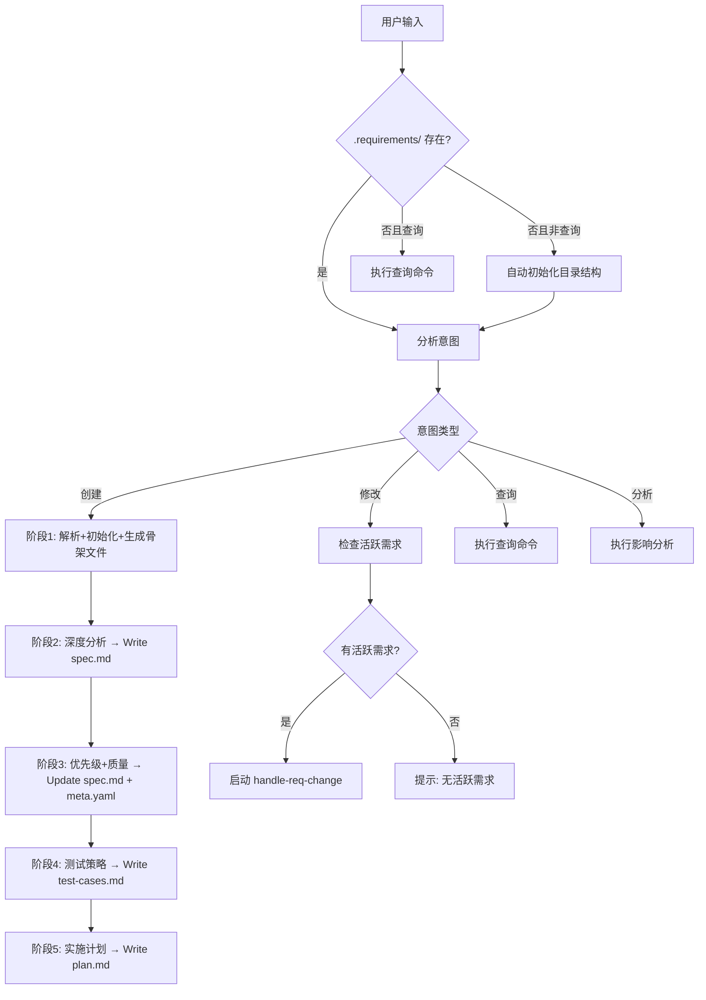

# 需求管理统一入口

根据用户意图自动路由到相应的处理流程，无需用户手动选择具体的 skill。

## ⛔️ 核心原则

**必须执行完整的5阶段工作流，绝不跳过任何阶段。**

无论需求看起来多么简单或直接，必须：
1. ✅ 调用 `node .claude/scripts/requirement-manager/index.js` 创建需求目录
2. ✅ 生成所有必需文档（raw.md, meta.yaml, spec.md, test-cases.md, plan.md）
3. ✅ 依次完成5个阶段（初始化→分析→优先级→测试→计划）
4. ✅ 在阶段5完成前，禁止编辑任何项目代码文件

**常见错误**：
- ❌ "这个需求很简单，直接写代码吧" → 违背核心原则
- ❌ "跳过文档，快速实现" → 违背核心原则
- ❌ "先写代码，再补文档" → 违背核心原则

**正确做法**：
- ✅ 所有需求都从创建`.requirements/`目录开始
- ✅ 完成文档后才能开始编码
- ✅ 保持文档和代码同步

## 智能路由逻辑

分析用户输入，自动识别意图并选择最优流程：

### 意图识别

| 意图类型       | 关键词                         | 路由到            | 触发条件                            |
| -------------- | ------------------------------ | ----------------- | ----------------------------------- |
| **创建新需求** | 添加、实现、新建、增加、开发   | brainstorm-grill  | 匹配创建类关键词                    |
| **修改需求**   | 修改、改变、调整、更新、改进   | handle-req-change | 匹配修改类关键词 + 存在活跃需求     |
| **查询需求**   | 查看、状态、列表、显示、有哪些 | req:query         | 匹配查询类关键词                    |
| **分析影响**   | 影响、依赖、风险、关联         | req:impact        | 匹配分析类关键词                    |
| **快速修复**   | 修复、bug、错误、问题          | brainstorm-grill  | 所有修复类需求必须走完整 5 阶段流程，不允许跳过文档 |

### ⚠️ 强制执行规则

**所有创建类需求必须走完整5阶段工作流，不允许跳过任何阶段。**

即使需求看起来"简单"或"小"，也必须：
1. 创建完整的`.requirements/{type}/{REQ-ID}/`目录结构
2. 生成所有必需文档（raw.md, meta.yaml, spec.md, test-cases.md, plan.md）
3. 完成所有5个阶段（解析→分析→优先级→测试→计划）
4. 在阶段5完成前，禁止编辑项目代码文件

**理由**：
- 文档是需求的唯一真实来源
- 跳过文档会导致需求丢失或理解偏差
- 即使"简单"需求也可能有隐藏的复杂性
- 知识图谱需要完整文档才能工作

### 自动推断规则

**需求类型推断**：

```
包含"登录"、"注册"、"用户" → feature
包含"bug"、"错误"、"崩溃"、"失败" → bug
包含"如何"、"怎么"、"为什么" → question
包含"重构"、"优化"、"改进" → refactor
包含"创建"、"实现"、"添加"、"开发" → feature
```

**模式推断**：

```
包含"快速"、"简单"、"小"、"马上" → semi_auto（非quick！）
包含"完整"、"详细"、"全面"、"深入" → deep
包含"自动"、"全自动" → auto
默认 → semi_auto
```

**重要**：`quick`模式已弃用，所有需求至少使用`semi_auto`模式以确保文档完整性。

## 简化用法

### 优化前 vs 优化后

**优化前**（需要记住多个选项）：

```bash
/req --feature --deep 添加用户登录功能
/req --bug --quick 修复登录崩溃
/req --question 如何实现OAuth？
```

**优化后**（智能推断）：

```bash
/req 添加用户登录功能           # 自动：feature + deep
/req 修复登录崩溃               # 自动：bug + semi_auto
/req 如何实现OAuth?             # 自动：question + semi_auto
```

## 执行流程



### ⛔ 阶段守卫

**代码修改只在阶段 5 完成之后允许。** 在此之前，只能编辑 `.requirements/` 目录内的文档文件。

当 PostToolUse hook 检测到活跃需求状态为 `planning` 或 `analyzed` 时编辑了外部文件，会输出警告。

## 使用示例

### 场景1: 创建新功能

```bash
用户: /req 添加用户头像上传功能

系统响应:
[意图识别] 创建新需求 (feature)
[模式推断] 深度分析模式 (deep)
[流程启动] brainstorm-grill...
```

### 场景2: Bug 修复

```bash
用户: /req 修复登录按钮样式

系统响应:
[意图识别] 修复问题 (bug)
[模式推断] 深度分析模式 (deep)
[流程启动] brainstorm-grill... (必须完成全部 5 阶段)
```

### 场景3: 修改现有需求

```bash
用户: /req 把登录改为OAuth

系统响应:
[意图识别] 修改需求
[检测] 发现活跃需求: REQ-20260513-001 (用户登录功能)
[流程启动] handle-req-change...
```

### 场景4: 查询需求

```bash
用户: /req 查看所有活跃需求

系统响应:
[意图识别] 查询需求
[执行] node .claude/scripts/requirement-manager/index.js --active
```

## 智能提示

当用户意图不明确时，提供引导：

```
你的需求不够明确，请选择：

1. 创建新需求 - 例如："添加用户登录功能"
2. 修改现有需求 - 例如："修改REQ-001的登录方式"
3. 查看需求状态 - 例如："查看活跃需求"
4. 快速修复 - 例如："修复登录bug"

或者使用具体选项：
/req --feature 添加功能
/req --bug 修复问题
/req --semi-auto 标准处理（推荐）
```

## 集成说明

**替代**：

- 部分替代 `/req` 命令的直接调用
- 作为 `/req` 命令的智能路由层

**与现有 skills 的关系**：

- `brainstorm-grill`: 创建需求时调用
- `handle-req-change`: 修改需求时调用
- `test-plan-generator`: 设计完成后自动调用
- `writing-plans`: 测试计划完成后调用

**调用顺序**：

```
req-manager
  ↓
[创建] → brainstorm-grill → test-plan-generator → writing-plans
[修改] → handle-req-change → [可能需要] brainstorm-grill
[查询] → 查询脚本
[分析] → 分析脚本
```

## 配置选项

可以通过 `.claude/settings.json` 配置默认行为：

```json
{
  "req-manager": {
    "defaultMode": "semi_auto",
    "autoDetect": true,
    "deepThreshold": "复杂|完整|详细|全面",
    "enforceWorkflow": true
  }
}
```

**配置说明**：
- `defaultMode`: 默认模式（semi_auto推荐）
- `autoDetect`: 自动检测需求类型
- `deepThreshold`: 触发深度模式的关键词
- `enforceWorkflow`: 强制执行5阶段工作流（默认true，不建议关闭）

## 错误处理

### 常见错误提示

**错误1: 意图不明确**

```
无法识别你的意图。请明确你要：
- 创建新需求？
- 修改现有需求？
- 查看需求状态？

示例：
/req 添加用户登录功能
/req 修改REQ-001为OAuth
/req --active
```

**错误2: 修改需求但无活跃需求**

```
没有找到活跃的需求分支。

你可以：
1. 查看所有需求: /req --list
2. 创建新需求: /req 添加新功能
3. 指定需求ID: /req 修改 REQ-001 ...
```

## 优势

1. **降低学习成本**
   - 不需要记住所有选项
   - 智能推断减少输入

2. **减少错误**
   - 自动选择合适流程
   - 提供清晰的反馈

3. **提升效率**
   - 跳过不必要的步骤
   - 快速通道处理简单需求

4. **保持灵活性**
   - 仍可使用完整选项
   - 高级用户可精确控制
