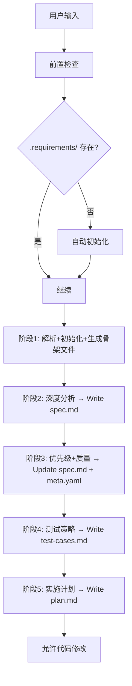

# 需求管理命令系统

完整的5阶段工作流需求管理系统，确保每个需求都经过完整的分析和规划过程。

## 核心原则

**⛔ 阶段守卫**：代码修改只能在阶段5（实施计划）完成后进行。在此之前，只能编辑`.requirements/`目录内的文档文件。

当PostToolUse hook检测到活跃需求状态为`planning`或`analyzed`时编辑了外部文件，会输出警告。

## 工作流阶段



## 命令结构

### 基本语法

```
req [--type TYPE] [--mode MODE] [--exec EXEC] [QUERY_OPTIONS] [描述]
```

### 类型选项

| 选项 | 需求类型 | 前缀 | 说明 |
|------|----------|------|------|
| `--feature` 或 `--feat` | 新功能 | FEAT | 添加新功能或特性 |
| `--bug` | Bug修复 | BUG | 修复缺陷或错误 |
| `--question` 或 `--ques` | 问题 | QUES | 提出技术问题 |
| `--adjustment` 或 `--adj` | 调整 | ADJU | 对现有功能进行调整 |
| `--refactor` 或 `--ref` | 重构 | REF | 代码重构优化 |

### 分析模式

| 选项 | 模式 | 说明 | 适用场景 |
|------|------|------|----------|
| `--quick` | 快速模式 | 跳过深度分析，直接生成基础文档 | 简单任务、紧急修复 |
| `--deep` | 深度模式 | 完整的5阶段工作流，包含AI分析 | 复杂功能、重要需求 |
| `--auto` | 自动模式 | 无需确认，自动完成所有阶段 | 自动化场景 |
| `--semi-auto` 或默认 | 半自动模式 | 关键节点需要用户确认 | 日常开发（推荐） |

### 执行选项

| 选项 | 说明 |
|------|------|
| `--exec` | 自动执行生成的实施计划 |
| `--no-exec` | 只生成计划，不自动执行 |

### 查询选项

| 选项 | 说明 | 输出 |
|------|------|------|
| `--list` | 列出所有需求 | 表格形式 |
| `--active` | 显示活跃需求 | 当前正在处理的需求 |
| `--status` | 显示需求状态统计 | 按状态分组 |
| `--dashboard` | 显示完整仪表板 | 多维度统计 |

## 智能推断

当未明确指定类型时，系统会自动推断：

```
包含"登录"、"注册"、"用户" → feature
包含"bug"、"错误"、"崩溃"、"失败" → bug
包含"如何"、"怎么"、"为什么" → question
包含"重构"、"优化"、"改进" → refactor
```

## 执行流程

### 阶段1：解析和初始化

**调用脚本**：`node .claude/scripts/requirement-manager/index.js`

**操作**：
1. 解析用户输入，确定需求类型和模式
2. 生成需求ID（格式：`{前缀}-{YYYYMMDD}-{序号}`）
3. 创建目录结构：`.requirements/{type}/{REQ-ID}/`
4. 生成骨架文件：
   - `raw.md` - 原始需求记录
   - `meta.yaml` - 需求元数据
   - `spec.md` - 需求规格说明（初始版本）
   - `test-cases.md` - 测试用例（初始版本）
   - `plan.md` - 实施计划（初始版本）

### 阶段2：深度分析

**调用skill**：`req-brainstorm`

**操作**：
1. 深度分析需求背景、目标、约束条件
2. 识别关键假设和风险
3. 生成完整的`spec.md`，包含：
   - 背景和动机
   - 用户故事
   - 技术方案设计
   - API设计（如适用）
   - 技术决策记录

### 阶段3：优先级和质量评估

**调用skills**：`req-priority` + `req-quality`

**操作**：
1. **优先级评估**：
   - 业务价值分析
   - 技术复杂度评估
   - 依赖关系识别
   - 生成`priority.md`
2. **质量检查**：
   - INVEST原则检查
   - SMART目标验证
   - 完整性评估
   - 更新`meta.yaml`中的质量评分

### 阶段4：测试策略

**调用skill**：`req-test-plan`

**操作**：
1. 设计测试策略
2. 生成完整测试用例：
   - 正向测试用例（`test-cases/positive.md`）
   - 负向测试用例（`test-cases/negative.md`）
   - 边界条件测试（`test-cases/boundary.md`）
3. 更新`test-cases.md`

### 阶段5：实施计划

**调用skill**：`writing-plans`

**操作**：
1. 分解任务为可执行步骤
2. 定义里程碑和交付物
3. 估算工作量
4. 生成完整的`plan.md`，包含：
   - 任务列表（`plan/tasks.md`）
   - 里程碑（`plan/milestones.md`）
   - 风险和缓解措施

## 相似度检测

在每个阶段完成后，系统会：

1. 调用知识图谱搜索相似需求
2. 显示3个最相似的历史需求
3. 标记潜在重复或冲突
4. 提供复用建议

**调用脚本**：`bin/kg-search "需求描述" 3`

## 前置检查

执行前自动检查：

1. **项目初始化检查**
   - 验证`.requirements/`目录存在
   - 如不存在，自动运行初始化

2. **活跃需求检查**
   - 检查是否有活跃需求分支
   - 提示用户是否需要切换或完成当前需求

3. **依赖检查**
   - 验证Node.js版本
   - 检查必要的依赖是否安装

## 安全检查

1. **敏感数据检查**
   - 扫描需求描述中的敏感信息
   - 警告用户潜在的安全风险

2. **可行性检查**
   - 评估技术可行性
   - 识别潜在的技术障碍

## 使用示例

### 场景1：创建新功能（深度模式）

```
req --feature --deep 添加用户头像上传功能
```

**执行流程**：
1. 解析为feature类型，深度模式
2. 生成ID：`FEAT-20260526-001-a3b2c1`
3. 完整5阶段工作流
4. 每个阶段需要用户确认

### 场景2：快速Bug修复

```
req --bug --quick 修复登录按钮样式问题
```

**执行流程**：
1. 解析为bug类型，快速模式
2. 跳过深度分析
3. 生成基础文档
4. 立即可开始修复

### 场景3：自动执行实施计划

```
req --feature --exec 实现用户消息推送
```

**执行流程**：
1. 完成5阶段工作流
2. 自动执行生成的plan.md
3. 持续跟踪进度

### 场景4：查询需求状态

```
req --dashboard
```

**输出**：完整的需求统计仪表板

### 场景5：智能推断

```
req 如何实现OAuth认证？
```

**自动推断**：
- 类型：question（包含"如何"）
- 模式：semi-auto（默认）
- ID：`QUES-20260526-001`

## 错误处理

### 常见错误

**错误1：未指定需求描述**

```
错误：必须提供需求描述或查询选项
用法：req [选项] <描述>
示例：req --feature 添加用户登录
```

**错误2：阶段守卫触发**

```
警告：检测到在规划阶段编辑了外部文件
当前需求状态：planning
允许编辑：.requirements/ 目录内的文档文件
请先完成5阶段工作流，再进行代码修改
```

**错误3：相似需求检测**

```
警告：发现相似需求
- FEAT-20260520-003-b4d5e6 (相似度: 85%)
- FEAT-20260515-001-c7f8a9 (相似度: 72%)

是否继续创建新需求？(y/n)
```

## 集成说明

**替代**：
- 完全替代`commands/req.md`命令在Codex中的功能

**与现有skills的关系**：
- `req-manager`：智能路由和简化入口
- `req-brainstorm`：阶段2深度分析
- `req-priority`：阶段3优先级评估
- `req-quality`：阶段3质量检查
- `req-test-plan`：阶段4测试策略
- `writing-plans`：阶段5实施计划

**调用顺序**：

```
req (本skill)
  ↓
[阶段2] → req-brainstorm
  ↓
[阶段3] → req-priority + req-quality
  ↓
[阶段4] → req-test-plan
  ↓
[阶段5] → writing-plans
```

## 与Claude Code的差异

| 特性 | Claude Code | Codex (本skill) |
|------|-------------|----------------|
| 调用方式 | `/req 命令` | 自然语言描述 |
| 参数传递 | 命令行选项 | 对话式推断 |
| 确认机制 | 自动/手动选项 | 对话式确认 |
| 执行模式 | 命令式 | 对话式 |

**示例对比**：

Claude Code：
```bash
/req --feature --deep 添加用户登录
```

Codex：
```
我想添加一个用户登录功能，请使用req skill的深度模式
```

或者：
```
使用req skill创建一个新功能需求：用户登录
```

## 配置选项

可以通过`.claude/settings.json`配置默认行为：

```json
{
  "req": {
    "defaultType": "feature",
    "defaultMode": "semi_auto",
    "autoConfirm": false,
    "maxSimilarity": 80,
    "requireQualityGate": true
  }
}
```

## 最佳实践

1. **明确需求描述**
   - 好："添加用户头像上传功能，支持裁剪和压缩"
   - 差："上传功能"

2. **选择合适的模式**
   - 简单任务：`--quick`
   - 重要功能：`--deep`
   - 日常使用：默认（semi-auto）

3. **遵守阶段守卫**
   - 不要跳过文档阶段
   - 完成规划后再编码
   - 保持文档和代码同步

4. **利用相似度检测**
   - 查看历史需求
   - 复用已有方案
   - 避免重复工作

5. **定期查询状态**
   - 使用`--dashboard`查看整体进度
   - 使用`--active`跟踪当前需求
   - 使用`--status`了解项目健康度
